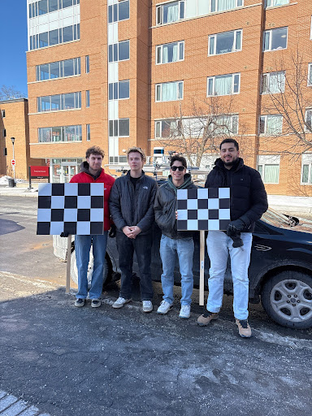
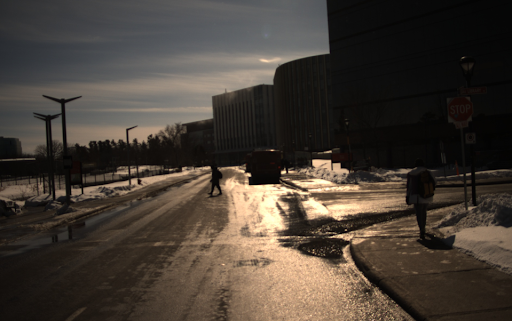
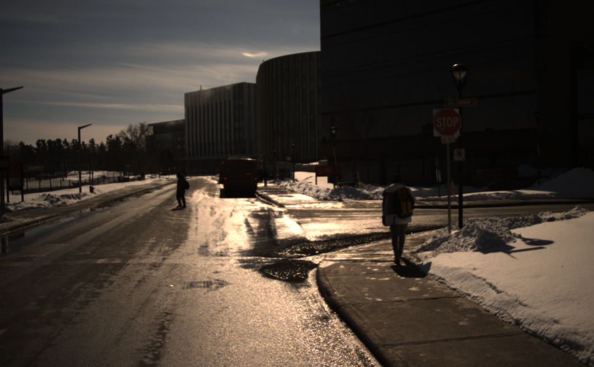
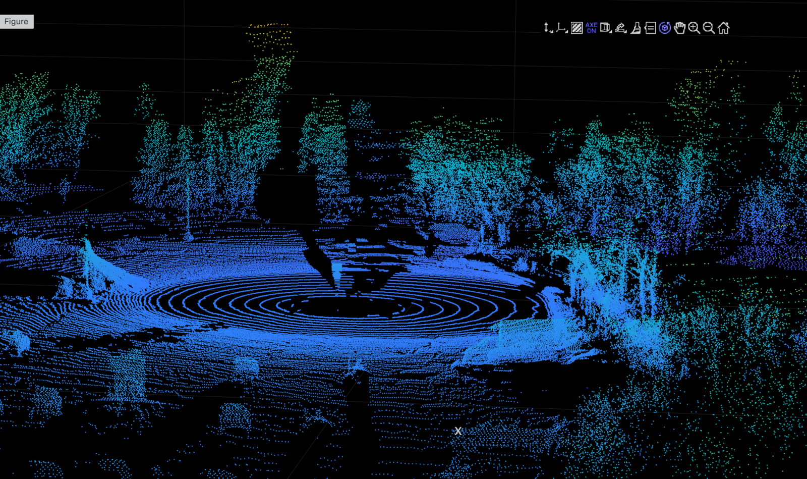
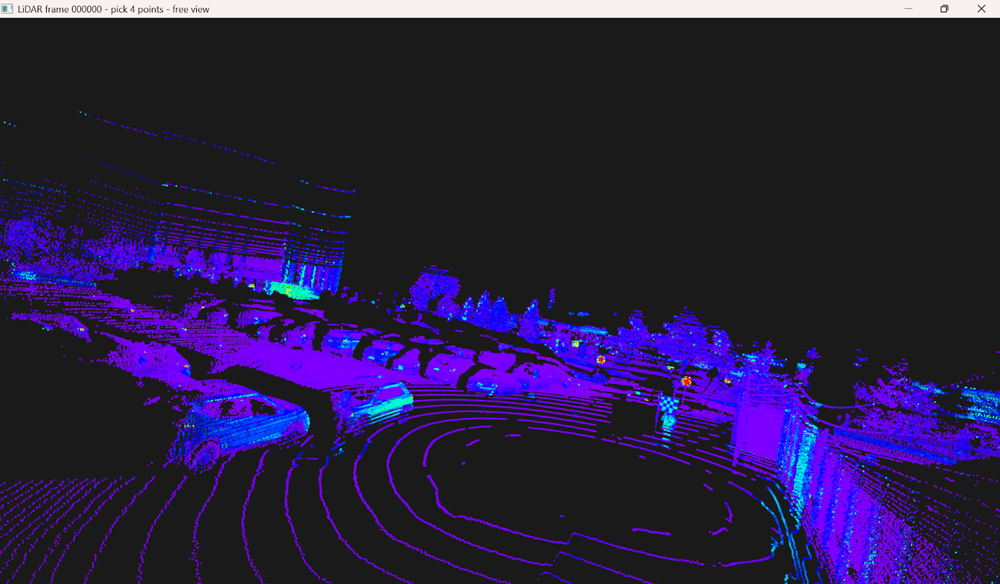

# CU26 Dataset: Multimodal LiDAR–Camera Dataset for Autonomous Driving

## Overview

The **CU26 dataset** is a multimodal autonomous driving dataset collected in Ottawa, Canada using a **Velodyne VLP-128 LiDAR** and **two front-facing Grasshopper RGB cameras**.

Developed as part of a capstone project at **Carleton University**, this dataset enables research in:

* LiDAR–camera sensor fusion
* 3D perception and object detection
* Calibration and projection
* Autonomous driving in real-world conditions

> ⚠️ **Important:** This dataset is **raw and unannotated** (no labels provided).

---

## ⬇️ Download

👉 **[Download from Google Drive](https://drive.google.com/drive/folders/17RymOEIRjV1r-T1K7hTB9jAJCRWBlEul?usp=sharing)**

---
## 👥 Team



* Michael Ramsey
* Edward Hebert
* Clark Brake
* Aziz Al-Najjar

---

## 📍 Data Collection Locations

### Main Campus Route


### Secondary Route (Hog’s Back / McDonald's Area)


Data was collected in:

* Carleton University Campus
* Hog’s Back Park
* Nearby McDonald's parking lot

---

## 🧰 Sensor Platform

### Physical Setup


### Platform Design


**Sensors:**

* **LiDAR:** Velodyne VLP-128
* **Cameras:**

  * `primary_camera` (front-left)
  * `secondary_camera` (front-right)

---

## 📦 Dataset Details

* **Format:** ROS bag files (`.bag`)
* **Total Size:** ~90+ GB
* **Number of Files:** 8 bag files

  * 6 driving sequences
  * 2 calibration sequences (checkerboard)
* **Frame Count:** ~200 – 1200+ frames per sequence

### ROS Topics

```bash
/velodyne_points
/primary_camera
/secondary_camera
```

---

## 🖼️ Sample Data

### Camera Views

**Primary Camera** 

**Secondary Camera** 

---

### LiDAR Point Clouds




---

### Sensor Fusion (RViz)


---

## 🔧 Calibration

Two bag files are dedicated to calibration using a checkerboard.

👉 [https://github.com/mtyramsey/Multiframe-pointcloud-registeration-and-multi-camera-projection](https://github.com/mtyramsey/Multiframe-pointcloud-registeration-and-multi-camera-projection)

---

## 🚀 Getting Started

```bash
rosbag play your_file.bag
```

Then open:

```bash
rviz
```

---

## ⚠️ Limitations

* No annotations
* Ottawa-only environment
* Domain shift from standard datasets

---

## 📚 Citation

```bibtex
@misc{cu26dataset,
  title={CU26 Dataset: Multimodal LiDAR and RGB Data for Autonomous Driving},
  author={Ramsey, Michael and Hebert, Edward and Brake, Clark},
  year={2026}
}
```
